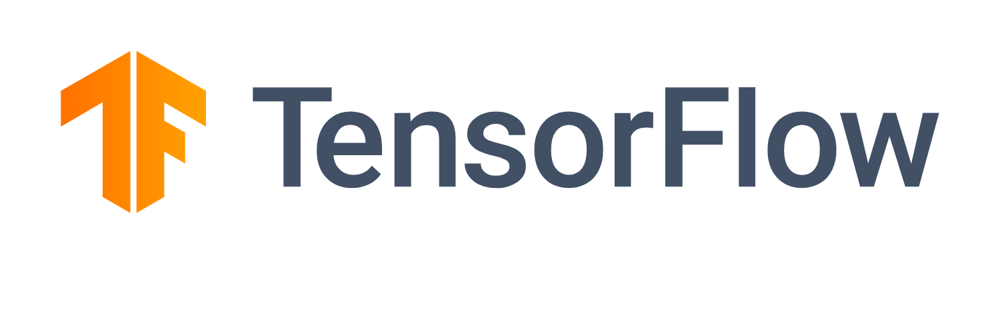

# CNN Regression

## How to Install
Run following command:
```
pip install -r requirements.txt
```

## Age Prediction   👩🏻‍🦱🧔🏻👨🏻👦🏽👩🏽‍🦳

### How to Run
Execute this command in terminal:
```
jupyter nbconvert --to script age_prediction.ipynb
```

### Results
model loss:

|  |  Train  | Validation |
| --------------- | --------------- | --------------- |
| MSE | 348.25 | 334.14 |


## Home Price Prediction 🏡💴
### How to Run
Execute this command in terminal:
```
jupyter nbconvert --to script home_price_prediction.ipynb
```

### Results

|  |  Train  | Validation |
| --------------- | --------------- | --------------- |
| MAPE | 41.89 | 49.79 |


## Python
This program is written using [Python](https://www.python.org/) language and the following tools:




